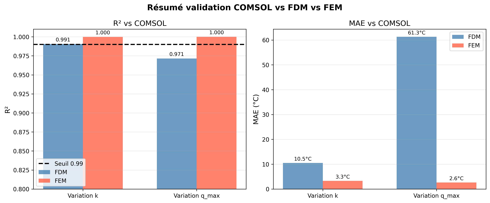
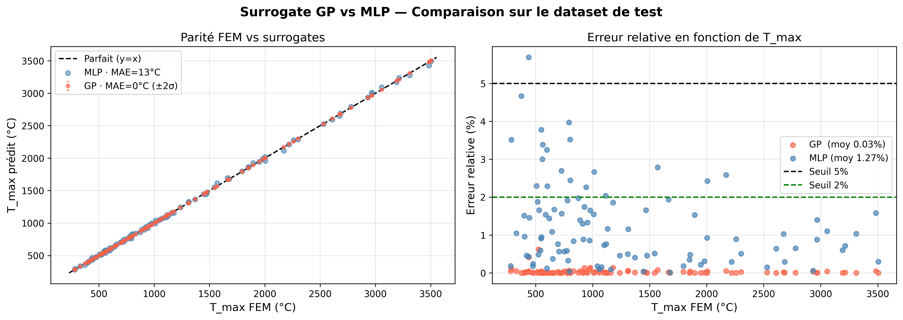

# TPS Thermal Surrogate — Physics-Based ML for Spacecraft Reentry

[](https://python.org)
[](https://scikit-learn.org)
[](https://streamlit.io)
[](LICENSE)

> A high-fidelity surrogate model for thermal protection system (TPS) simulation during spacecraft atmospheric reentry. Combines FDM and FEM numerical solvers with Gaussian Process and MLP surrogate models — achieving **R²=0.9999** and **0.03% error** at **100,000× speedup** over full FEM simulation.

---

## Table of Contents

- [Problem Statement](#problem-statement)
- [Governing Equations](#governing-equations)
- [Numerical Methods](#numerical-methods)
- [Dataset Generation](#dataset-generation)
- [Surrogate Models](#surrogate-models)
- [Results](#results)
- [Installation](#installation)
- [Usage](#usage)
- [Project Structure](#project-structure)
- [Future Work](#future-work)

---

## Problem Statement

During atmospheric reentry, a spacecraft's thermal protection system (TPS) is subjected to an intense plasma heat flux. The structure must withstand temperatures exceeding 1500°C without melting. The governing challenge is:

> **Given material properties (k), geometry (L), and heat flux (q_max), predict the maximum temperature T_max reached by the structure.**

Full FEM simulation takes ~90 seconds per evaluation — prohibitive for design optimization. This project builds surrogate models that predict T_max **instantaneously** with engineering-grade accuracy.

---

## Governing Equations

### 2D Transient Heat Equation

The temperature field T(x, y, t) satisfies:

$$\rho c_p \frac{\partial T}{\partial t} = k \left( \frac{\partial^2 T}{\partial x^2} + \frac{\partial^2 T}{\partial y^2} \right)$$

**Top face (plasma flux, Neumann BC):**

$$q_{plasma}(t) = q_{max} \sin\left(\frac{\pi t}{t_{entree}}\right), \quad 0 \leq t \leq t_{entree}$$

**Bottom face (radiation, nonlinear Robin BC):**

$$-k \frac{\partial T}{\partial n} = \sigma \varepsilon \left( T^4 - T_{stru}^4 \right)$$

**Parameters:**

| Symbol | Description | Value |
|--------|-------------|-------|
| ρ | Density | 1800 kg/m³ |
| c_p | Specific heat | 800 J/(kg·K) |
| k | Thermal conductivity | 0.2–15 W/(m·K) |
| ε | Emissivity | 0.85 |
| σ | Stefan-Boltzmann constant | 5.67×10⁻⁸ W/(m²·K⁴) |
| t_entree | Plasma entry duration | 1200 s |
| T_initial | Initial temperature | 293.15 K |

---

## Numerical Methods

### Finite Difference Method (FDM)

The FDM discretizes the domain on a uniform 21×21 grid with implicit Euler (Δt = 10s). The radiation boundary condition is linearized as:

$$h_{rad}(T) = \sigma \varepsilon (T^2 + T_{stru}^2)(T + T_{stru})$$

**Validation vs COMSOL:** R² = 0.991, MAE = 10.5°C

---

### Finite Element Method (FEM)

The FEM uses **bilinear quadrilateral Q4 elements** with **2×2 Gauss integration**:

$$\left(\frac{\mathbf{M}}{\Delta t} + \mathbf{K} + \mathbf{K}_{rad}\right) \mathbf{T}^{n+1} = \frac{\mathbf{M}}{\Delta t} \mathbf{T}^n + \mathbf{f}_{plasma} + \mathbf{R}_{rad}$$

The nonlinear radiation term is handled via Newton-Raphson iterations with adaptive under-relaxation:

| k (W/m·K) | Relaxation ω |
|-----------|-------------|
| k < 0.5   | 0.2 |
| k < 1.0   | 0.4 |
| k ≥ 1.0   | 0.7 |

**Validation vs COMSOL:** R² = 0.9999, MAE = 3°C



---

## Dataset Generation

### Parameter Space

| Parameter | Range | Sampling |
|-----------|-------|----------|
| k (W/m·K) | [0.2, 15.0] | Log-uniform |
| L (m) | [0.04, 0.12] | Uniform |
| q_max (W/m²) | [30,000, 80,000] | Uniform |

**Why log-uniform for k?** The thermal response varies exponentially with k, so uniform sampling underrepresents the critical low-k (high temperature) regime. Log-uniform gives equal coverage across all decades.

Each sample runs a full FEM simulation (dt=10s, 180 time steps, 21×21 mesh) and stores T(x,y,t) ∈ ℝ^(181×21×21). **500 simulations generated in ~52 min.**

---

## Surrogate Models

### MLP — Full Field Surrogate

Predicts the complete field T(x,y,t) from (k, L, q_max).

```
Input : (k, L, q_max) → Hidden: (1024, 512, 256, 128) ReLU → Output: 79,821 values
```

| R² test | MAE | Speedup |
|---------|-----|---------|
| 0.9875 | 8.3°C | 600× |

**Limitation:** predicting 79,821 outputs from 3 inputs leads to regression-to-mean on extreme k values (~9% error on T_max benchmark).

---

### MLP Scalar Surrogate

Predicts T_max only, with log-transform on k and T_max:

```python
X = [log(k), L, q_max]   →   y = log(T_max)
```

This linearizes the exponential T_max(k) relationship, making it trivial for the MLP.

| | MLP (no log) | MLP (with log) |
|-|-------------|----------------|
| R² test | 0.892 | 0.9995 |
| MAE | 58.6°C | 4.7°C |
| Error mean | 8.67% | 0.87% |

---

### Gaussian Process Surrogate

**Why GP over MLP for scalar prediction?**

| | MLP | GP |
|-|-----|-----|
| With 500 samples | Underfitting risk | Ideal regime |
| Uncertainty | None | Quantified ±σ |
| Training complexity | O(n) | O(n³) |

Matérn ν=2.5 kernel — consistent with twice-differentiable heat equation solutions. Trained on log(k), log(T_max).

| Metric | MLP Scalar | GP |
|--------|-----------|-----|
| R² test | 0.9995 | **0.9999** |
| MAE | 4.7°C | **0.31°C** |
| Error mean | 0.87% | **0.03%** |
| Error max | 2.83% | **0.63%** |
| Points < 2% | 81/100 | **100/100** |
| Uncertainty | — | ±1°C |
| Speedup vs FEM | ~300,000× | ~100,000× |



---

## Results

### Validation vs COMSOL

| Method | R² | MAE | Error mean |
|--------|-----|-----|-----------|
| FDM | 0.991 | 10.5°C | 1.53% |
| **FEM** | **0.9999** | **3.3°C** | **0.82%** |

### GP Benchmark by k value

| Case | FEM | GP | ±σ | Error | Speedup |
|------|-----|-----|-----|-------|---------|
| k=0.3 (very low) | 1616°C | 1616°C | ±1°C | 0.01% | 293,073× |
| k=0.5 (low) | 1565°C | 1566°C | ±1°C | 0.03% | 153,848× |
| k=2.0 (medium) | 948°C | 948°C | ±1°C | 0.00% | 81,681× |
| k=8.0 (high) | 574°C | 573°C | ±0°C | 0.02% | 92,969× |
| k=14.0 (very high) | 370°C | 371°C | ±1°C | 0.24% | 71,266× |

---

## Installation

```bash
git clone https://github.com/Brivell/tps-thermal-surrogate
cd tps-thermal-surrogate
pip install -r requirements.txt
```

> **Note:** `Models/surrogate_model.pkl` (253 MB, full-field MLP) is excluded from the repo. The GP and scalar MLP models are included.

---

## Usage

### Streamlit app

```bash
streamlit run app.py
```

### Retrain all surrogates

```bash
python run_all_train.py
```

Set `RUN_FEM_BENCHMARK = True` in the train scripts to run the full FEM validation benchmark (~5 min per script).

### Predict with GP surrogate

```python
import pickle, numpy as np

with open('Models/surrogate_gp.pkl', 'rb') as f:
    gp, scaler_X, scaler_y = pickle.load(f)

k, L, q_max = 2.0, 0.08, 50000
X_new = scaler_X.transform([[np.log(k), L, q_max]])
T_log, T_std_s = gp.predict(X_new, return_std=True)
T_max = np.exp(scaler_y.inverse_transform(T_log.reshape(-1, 1)))[0][0]
T_unc = T_max * T_std_s[0] * scaler_y.scale_[0]

print(f"T_max = {T_max:.1f}°C ± {T_unc:.1f}°C")
```

### Run FEM simulation

```python
import sys
sys.path.insert(0, 'Method function')
from tps_fct_fem import simulation_principale
import numpy as np

class prm:
    rho=1800; cp=800; k_therm=2.0; epsilon=0.85

Res = simulation_principale(
    [0, 0.1], [0, 0.1], 21, 21, 10.0, 1800.0,
    temps_instantanes=[], T_initiale=293.15, T_stru=293.15,
    t_entree=1200.0, q_max=50000, sigma=5.67e-8, prm=prm,
    save_all=True, verbose=True
)
print(f"T_max = {np.max(Res['T_field_complet']):.1f}°C")
```

---

## Project Structure

```
tps-thermal-surrogate/
├── app.py                           # Streamlit app entry point
├── validate_comsol.py               # Validation vs COMSOL (FDM + FEM)
├── run_all_train.py                 # Train all surrogates in one command
├── dataset_TPS.npz                  # 500 FEM simulations (log-uniform)
├── requirements.txt
│
├── Method function/
│   ├── tps_fct_fdm.py               # FDM solver
│   └── tps_fct_fem.py               # FEM solver (Q4, Newton-Raphson)
│
├── Train folder/
│   ├── train_surrogate_scalar.py    # MLP scalar surrogate (log-transform)
│   ├── train_surrogate_gp.py        # Gaussian Process surrogate
│   └── ml_surrogate1.py             # Full-field MLP surrogate
│
├── Models/
│   ├── surrogate_gp.pkl             # Trained GP model
│   ├── surrogate_tmax_scalar.pkl    # Trained scalar MLP
│   └── surrogate_model.pkl          # Full-field MLP (gitignored, 253 MB)
│
├── Validation/
│   ├── comsol_variation_k.txt       # COMSOL reference data
│   ├── comsol_variation_qmax.txt
│   └── Comsol_code.m                # COMSOL simulation script
│
├── pages/                           # Streamlit pages (6 pages)
├── utils/                           # Shared utilities (models, physics, plots)
├── assets/                          # CSS styles
└── images/                          # Generated plots
```

---

## Future Work

- [ ] **1000 samples** with log-uniform sampling → expected R² > 0.99 for full field
- [ ] **CNN decoder** — exploit spatial structure (21×21) → expected error ~2-3%
- [ ] **DeepONet** — operator learning for T(x,y,t) → expected error ~0.5-1%
- [ ] **PINN** — physics-informed neural network (no FEM data needed) → expected error ~0.1%

---

## References

- Zienkiewicz & Taylor — The Finite Element Method
- Rasmussen & Williams (2006) — Gaussian Processes for Machine Learning
- NASA TPS design guidelines

---

## License

MIT License — see [LICENSE](LICENSE) for details.
